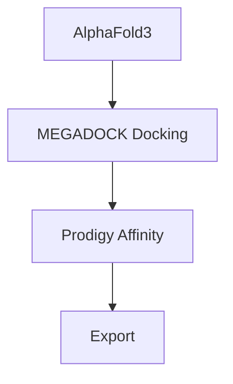

# AlphaFold3 & Docking Pipeline


This pipeline combines RFdiffusion for protein design with MEGADOCK for protein docking and Prodigy for binding affinity calculations.

## Table of Contents
1. [AlphaFold 3 Pipeline](#1-alphafold-3-pipeline)
2. [Protein Docking with MEGADOCK](#2-protein-docking-with-megadock)
3. [Binding Affinity Calculation](#3-binding-affinity-calculation)
4. [How to start?](#how-to-start)
5. [Pipeline Overview](#pipeline-overview)
---

## 1. AlphaFold 3 Pipeline
- [ ] TODO: update section 1.

### Installation

* Клонировать [репозиторий](https://github.com/google-deepmind/alphafold3?ysclid=mgot4mzvap467461191) в 3rdparty/alphafold3.
* Добавить модель в `models`, базы данных в `af_public_databases`.

Установка по [инструкции](https://github.com/google-deepmind/alphafold3/blob/main/docs/installation.md). 


## 2. Protein Docking with MEGADOCK

### Installation

* Клонировать репозиторий Megadock в 3rdparty/megadock.

```bash
git clone https://github.com/akiyamalab/MEGADOCK
```

* Добавить скрипт из `utils/run_multi_megadock.sh` в 3rdparty/megadock.

---

## 3. Binding Affinity Calculation

**Output Analysis:**  
The results in `data/output/prodigy/affinity.csv` can be used for binding affinity analysis and visualization.

---

## How to start
* Установить Docker.
* Выполнить шаги по установке из пунктов 1-3.
* Создать структуру папок с помощью `utils/create_folders.py`.
* Запустить `./init.sh` для сборки контейнеров.
* Запустить `./start.sh` для запуска пайплайна.

## Pipeline Overview

