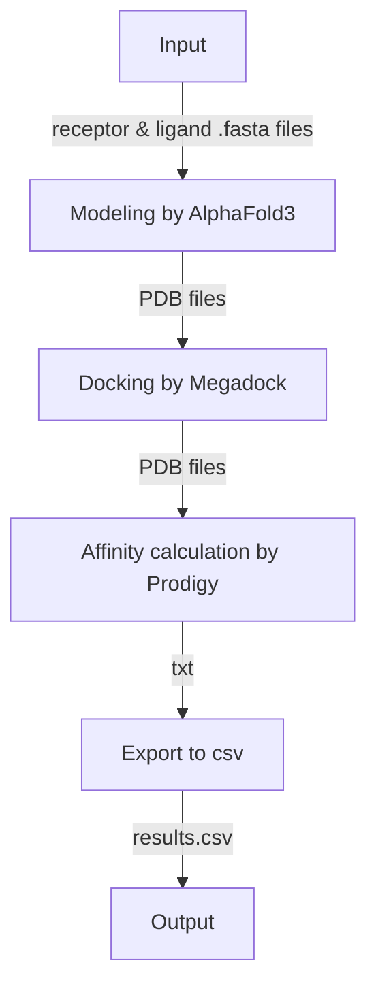

# AlphaFold3 & Docking Pipeline


This pipeline combines RFdiffusion for protein design with MEGADOCK for protein docking and Prodigy for binding affinity calculations.

## Table of Contents
1. [How to start?](#how-to-start)
2. [Pipeline Overview](#pipeline-overview)
3. [AlphaFold3](#1-alphafold3)
4. [Protein Docking with MEGADOCK](#2-protein-docking-with-megadock)
5. [Binding Affinity Calculation](#3-binding-affinity-calculation)

---

## How to start
* Установить Docker.
* Инициализировать репозиторий:
```bash
git submodule init
git submodule update
git pull --recurse-submodules
```
* Выполнить шаги по установке из пунктов [AlphaFold3](#1-alphafold3) и [Protein Docking with MEGADOCK](#2-protein-docking-with-megadock).
* Скопировать файл `.env.template` с именем `.env` и заполнить переменные окружения.
* Создать структуру папок с помощью `utils/create_folders.py`.
* Добавить входные файлы в формате .fasta или .json (важно: json со [структурой, требуемой Alphafold3](https://github.com/google-deepmind/alphafold3/blob/main/docs/input.md)) в папки `data/input/ligand` и `data/input/receptor`.
* Запустить `./init.sh` для сборки контейнеров.
* Запустить `./start.sh` для запуска пайплайна.

## Pipeline Overview


## Настройка модулей

### 1. AlphaFold3

Использован [репозиторий](https://github.com/google-deepmind/alphafold3?ysclid=mgot4mzvap467461191) в 3rdparty/alphafold3.

**Предварительно необходимо:**
* Добавить модель в `models` (разрешение на использование модели и ее параметры нужно запросить по [инструкции](https://github.com/google-deepmind/alphafold3/tree/main?tab=readme-ov-file#obtaining-model-parameters)).
* Базы данных в `af_public_databases`.

Подробнее можно поcмотреть в [оригинальной инструкции](https://github.com/google-deepmind/alphafold3/blob/main/docs/installation.md). 

#### Распаковка весов 

```bash
unpack_databases.sh <archive dir> <target dir>
```

```bash
.\zstd.exe -d Z:\distr\AF-RFD-Pipeline\AF3\public_databases\pdb_2022_09_28_mmcif_files.tar.zst -o F:\AF-RFD\public_databases\pdb_2022_09_28_mmcif_files.tar
+

.\zstd.exe -d Z:\distr\AF-RFD-Pipeline\AF3\public_databases\pdb_seqres_2022_09_28.fasta.zst -o F:\AF-RFD\public_databases\pdb_seqres_2022_09_28.fasta


.\zstd.exe -d Z:\distr\AF-RFD-Pipeline\AF3\public_databases\bfd-first_non_consensus_sequences.fasta.zst -o F:\AF-RFD\public_databases\bfd-first_non_consensus_sequences.fasta

.\zstd.exe -d Z:\distr\AF-RFD-Pipeline\AF3\public_databases\mgy_clusters_2022_05.fa.zst -o F:\AF-RFD\public_databases\mgy_clusters_2022_05.fa

.\zstd.exe -d Z:\distr\AF-RFD-Pipeline\AF3\public_databases\nt_rna_2023_02_23_clust_seq_id_90_cov_80_rep_seq.fasta.zst -o F:\AF-RFD\public_databases\nt_rna_2023_02_23_clust_seq_id_90_cov_80_rep_seq.fasta


.\zstd.exe -d Z:\distr\AF-RFD-Pipeline\AF3\public_databases\rfam_14_9_clust_seq_id_90_cov_80_rep_seq.fasta.zst -o F:\AF-RFD\public_databases\rfam_14_9_clust_seq_id_90_cov_80_rep_seq.fasta

.\zstd.exe -d Z:\distr\AF-RFD-Pipeline\AF3\public_databases\rnacentral_active_seq_id_90_cov_80_linclust.fasta.zst -o F:\AF-RFD\public_databases\rnacentral_active_seq_id_90_cov_80_linclust.fasta

.\zstd.exe -d Z:\distr\AF-RFD-Pipeline\AF3\public_databases\uniprot_all_2021_04.fa.zst -o F:\AF-RFD\public_databases\uniprot_all_2021_04.fa

.\zstd.exe -d Z:\distr\AF-RFD-Pipeline\AF3\public_databases\uniref90_2022_05.fa.zst -o F:\AF-RFD\public_databases\uniref90_2022_05.fa
```

### 2. Protein Docking with MEGADOCK

* Репозиторий Megadock в 3rdparty/megadock.
* Скрипт `utils/run_multi_megadock.sh` автоматически копируется при инициализации.

---

### 3. Binding Affinity Calculation

**Output Analysis:**
Результаты сохраняются в виде csv файла по пути `data/output/prodigy/affinity.csv`.

---
