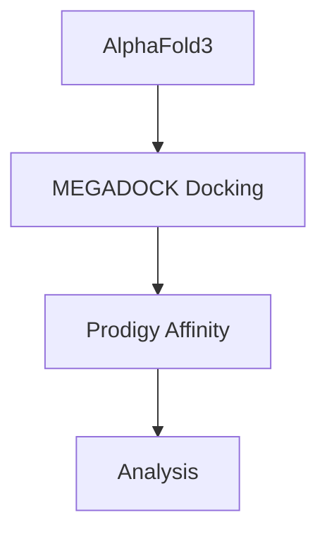

# AlphaFold3 & Docking Pipeline


This pipeline combines RFdiffusion for protein design with MEGADOCK for protein docking and Prodigy for binding affinity calculations.

## Table of Contents
1. [AlphaFold 3 Pipeline](#1-alphafold-3-pipeline)
2. [Protein Docking with MEGADOCK](#2-protein-docking-with-megadock)
3. [Binding Affinity Calculation](#3-binding-affinity-calculation)

---

## 1. AlphaFold 3 Pipeline

Used [repo](https://github.com/google-deepmind/alphafold3?ysclid=mgot4mzvap467461191).

Установка по [инструкции](https://github.com/google-deepmind/alphafold3/blob/main/docs/installation.md). 

Для БД:
`choco install wget -y` 

## 2. Protein Docking with MEGADOCK

### Installation

Клонирвоаь репозиторий Megadock.

Requires MEGADOCK-GPU (non-MPI version):
```bash
git clone https://github.com/akiyamalab/MEGADOCK
```

Обновить докерфайл на файл `megadock-patry\Dockerfile` и добавить скрипт `megadock-patry\run_multi_megadock.sh`.

### Running Docking

`./run_multi_megadock.sh` внутри контейнера.

---

## 3. Binding Affinity Calculation

### Setup Prodigy
```bash
python -m venv ./venv
source ./venv/bin/activate
pip install prodigy-prot
```

### Calculation Script
```bash
#!/bin/bash
# ./util_scripts/script_affinity.sh

OUTPUT_FILE="prodigy_results.txt"
> "$OUTPUT_FILE"

for pdb in $(find . -name *-complex.pdb); do
  echo "===== Calculating for $pdb =====" >> "$OUTPUT_FILE"
  prodigy "$pdb" --selection A Y >> "$OUTPUT_FILE" 2>&1
  echo "" >> "$OUTPUT_FILE"
done
```

**Usage:**
```bash
chmod +x script_affinity.sh
./script_affinity.sh
```

**Output Analysis:**  
The results in `prodigy_results.txt` can be used for binding affinity analysis and visualization.

---

## Pipeline Overview

