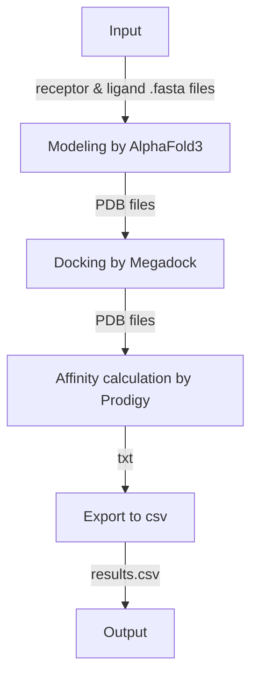

# AlphaFold3 & Docking Pipeline


This pipeline combines RFdiffusion for protein design with MEGADOCK for protein docking and Prodigy for binding affinity calculations.

## Table of Contents
- [AlphaFold3 \& Docking Pipeline](#alphafold3--docking-pipeline)
  - [Table of Contents](#table-of-contents)
  - [How to start](#how-to-start)
  - [Pipeline Overview](#pipeline-overview)
  - [Описание шагов пайплайна](#описание-шагов-пайплайна)
    - [Шаг 1 — Запуск контейнеров](#шаг-1--запуск-контейнеров)
    - [Шаг 2 — Конвертация FASTA → JSON (`fasta2json`)](#шаг-2--конвертация-fasta--json-fasta2json)
    - [Шаг 3 — Структурное моделирование AlphaFold3](#шаг-3--структурное-моделирование-alphafold3)
    - [Шаг 4 — Конвертация CIF → PDB (`cif2pdb`)](#шаг-4--конвертация-cif--pdb-cif2pdb)
    - [Шаг 5 — Молекулярный докинг Megadock](#шаг-5--молекулярный-докинг-megadock)
    - [Шаг 6 — Расчёт аффинности связывания Prodigy](#шаг-6--расчёт-аффинности-связывания-prodigy)
    - [Шаг 7 — Экспорт результатов в CSV](#шаг-7--экспорт-результатов-в-csv)
    - [Шаг 8 — Остановка контейнеров](#шаг-8--остановка-контейнеров)
  - [Настройка модулей](#настройка-модулей)
    - [1. AlphaFold3](#1-alphafold3)
      - [Распаковка весов](#распаковка-весов)
    - [2. Protein Docking with MEGADOCK](#2-protein-docking-with-megadock)
    - [3. Binding Affinity Calculation](#3-binding-affinity-calculation)

---

## How to start
* Установить Docker.
* Инициализировать репозиторий:
```bash
git submodule init
git submodule update
git pull --recurse-submodules
```
* Выполнить шаги по установке из пунктов [AlphaFold3](#1-alphafold3) и [Protein Docking with MEGADOCK](#2-protein-docking-with-megadock).
* Скопировать файл `.env.template` с именем `.env` и заполнить переменные окружения.
* Создать структуру папок с помощью `utils/create_folders.py`.
* Добавить входные файлы в формате .fasta или .json (важно: json со [структурой, требуемой Alphafold3](https://github.com/google-deepmind/alphafold3/blob/main/docs/input.md)) в папки `data/input/ligand` и `data/input/receptor`.
* Запустить `./init.sh` для сборки контейнеров.
* Запустить `./start.sh` для запуска пайплайна.

## Pipeline Overview

```mermaid
graph TD
    Start[Input] -->|receptor & ligand .fasta files| A[Modeling by AlphaFold3]
    A -->|PDB files| B[Docking by Megadock]
    B -->|PDB files| C[Affinity calculation by Prodigy]
    C -->|txt| D[Export to csv]
    D -->|results.csv| End[Output]
```

## Описание шагов пайплайна
Шаги в скрипте start.sh.

### Шаг 1 — Запуск контейнеров
Запускаются Docker-контейнеры через `docker-compose up -d`. Используются три контейнера: `alphafold3_container`, `megadock_container`, `prodigy_container`. После запуска скрипт ожидает 10 секунд для завершения инициализации.

### Шаг 2 — Конвертация FASTA → JSON (`fasta2json`)
Скрипт `utils/fasta2json.py` обходит папку `data/input` и конвертирует все `.fasta`-файлы в формат `.json`, который принимает AlphaFold3. Входные файлы для лиганда и рецептора размещаются раздельно в `data/input/ligand` и `data/input/receptor`.

### Шаг 3 — Структурное моделирование AlphaFold3
AlphaFold3 запускается последовательно для лиганда и рецептора. Используется режим Jackhmmer/nhmmer для поиска MSA (множественного выравнивания последовательностей) по сегментированным базам данных (BFD, RNAcentral, Rfam), что ускоряет поиск на нескольких дисках. Результаты (`.cif`-файлы) сохраняются в `data/output/alphafold3/ligand` и `data/output/alphafold3/receptor`.

### Шаг 4 — Конвертация CIF → PDB (`cif2pdb`)
Скрипт `utils/cif2pdb.py` конвертирует все `.cif`-файлы из папки `data/output/alphafold3` в формат `.pdb`, необходимый для Megadock.

### Шаг 5 — Молекулярный докинг Megadock
Внутри контейнера `megadock_container` выполняется скрипт `run_multi_megadock.sh`. Megadock перебирает все пары лиганд–рецептор и рассчитывает комплексы. Результаты (`.pdb`) сохраняются в `data/output/megadock`.

### Шаг 6 — Расчёт аффинности связывания Prodigy
Контейнер `prodigy_container` запускает `run_prodigy.sh` для каждого докинг-комплекса и оценивает энергию взаимодействия (ΔG, Kd) методом PRODIGY. Результаты в формате `.txt` сохраняются в `data/output/prodigy`.

### Шаг 7 — Экспорт результатов в CSV
Скрипт `analyze.py` внутри контейнера Prodigy парсит все `.txt`-файлы и агрегирует данные в итоговый файл `data/output/prodigy/affinity.csv`.

### Шаг 8 — Остановка контейнеров
После завершения всех шагов выполняется `docker-compose down` для корректной остановки всех контейнеров.

---

## Настройка модулей

### 1. AlphaFold3

Использован [репозиторий](https://github.com/google-deepmind/alphafold3?ysclid=mgot4mzvap467461191) в 3rdparty/alphafold3.

**Предварительно необходимо:**
* Добавить модель в `models` (разрешение на использование модели и ее параметры нужно запросить по [инструкции](https://github.com/google-deepmind/alphafold3/tree/main?tab=readme-ov-file#obtaining-model-parameters)).
* Базы данных в `af_public_databases`.

Подробнее можно поcмотреть в [оригинальной инструкции](https://github.com/google-deepmind/alphafold3/blob/main/docs/installation.md). 

#### Распаковка весов 

Необходимое место для баз:
| Файл / папка                                                | Размер, Gb |
|-------------------------------------------------------------|------------|
| rnacentral_active_seq_id_90_cov_80_linclust.fasta           | 13.6       |
| mgy_clusters_2022_05.fa                                     | 125.6      |
| bfd-first_non_consensus_sequences.fasta                     | 17.75      |
| uniref90_2022_05.fa                                         | 70.2       |
| uniprot_all_2021_04.fa                                      | 106        |
| pdb_seqres_2022_09_28.fasta                                 | 0.25       |
| rfam_14_9_clust_seq_id_90_cov_80_rep_seq.fasta              | 0.24       |
| nt_rna_2023_02_23_clust_seq_id_90_cov_80_rep_seq.fasta      | 70.1       |
| mmcif_files (folder)                                        | 233        |
| **Всего**                                                   | **636.74** |

Для разархивации использовать команды ниже. Базы не обязательно хранить на одном диске, лучше использовать SSD. 
Для ускорения поиска MSA можно использовать сегментированные базы (см. скрипт `create_sharded_db.sh`) - тогда команда запуска меняется (см. файл `start.sh`).

```bash
.\zstd.exe -d Z:\distr\AF-RFD-Pipeline\AF3\public_databases\pdb_2022_09_28_mmcif_files.tar.zst -o F:\AF-RFD\public_databases\pdb_2022_09_28_mmcif_files.tar

.\zstd.exe -d Z:\distr\AF-RFD-Pipeline\AF3\public_databases\pdb_seqres_2022_09_28.fasta.zst -o F:\AF-RFD\public_databases\pdb_seqres_2022_09_28.fasta

.\zstd.exe -d Z:\distr\AF-RFD-Pipeline\AF3\public_databases\bfd-first_non_consensus_sequences.fasta.zst -o F:\AF-RFD\public_databases\bfd-first_non_consensus_sequences.fasta

.\zstd.exe -d Z:\distr\AF-RFD-Pipeline\AF3\public_databases\mgy_clusters_2022_05.fa.zst -o F:\AF-RFD\public_databases\mgy_clusters_2022_05.fa

.\zstd.exe -d Z:\distr\AF-RFD-Pipeline\AF3\public_databases\nt_rna_2023_02_23_clust_seq_id_90_cov_80_rep_seq.fasta.zst -o F:\AF-RFD\public_databases\nt_rna_2023_02_23_clust_seq_id_90_cov_80_rep_seq.fasta

.\zstd.exe -d Z:\distr\AF-RFD-Pipeline\AF3\public_databases\rfam_14_9_clust_seq_id_90_cov_80_rep_seq.fasta.zst -o F:\AF-RFD\public_databases\rfam_14_9_clust_seq_id_90_cov_80_rep_seq.fasta

.\zstd.exe -d Z:\distr\AF-RFD-Pipeline\AF3\public_databases\rnacentral_active_seq_id_90_cov_80_linclust.fasta.zst -o F:\AF-RFD\public_databases\rnacentral_active_seq_id_90_cov_80_linclust.fasta

.\zstd.exe -d Z:\distr\AF-RFD-Pipeline\AF3\public_databases\uniprot_all_2021_04.fa.zst -o F:\AF-RFD\public_databases\uniprot_all_2021_04.fa

.\zstd.exe -d Z:\distr\AF-RFD-Pipeline\AF3\public_databases\uniref90_2022_05.fa.zst -o F:\AF-RFD\public_databases\uniref90_2022_05.fa
```

Так же для ускорения можно воспользоваться скриптом [`abcfold/scripts/add_mmseqs_msa.py`](https://github.com/rigdenlab/ABCFold/blob/f300d3cc47fc92f8b6ee2db52b42d600b6d17566/README.md?plain=1#L234) из репозитория [ABCFold](https://github.com/rigdenlab/ABCFold).

### 2. Protein Docking with MEGADOCK

* Репозиторий Megadock в 3rdparty/megadock.
* Скрипт `utils/run_multi_megadock.sh` автоматически копируется при инициализации.

---

### 3. Binding Affinity Calculation

**Output Analysis:**
Результаты сохраняются в виде csv файла по пути `data/output/prodigy/affinity.csv`.

---
