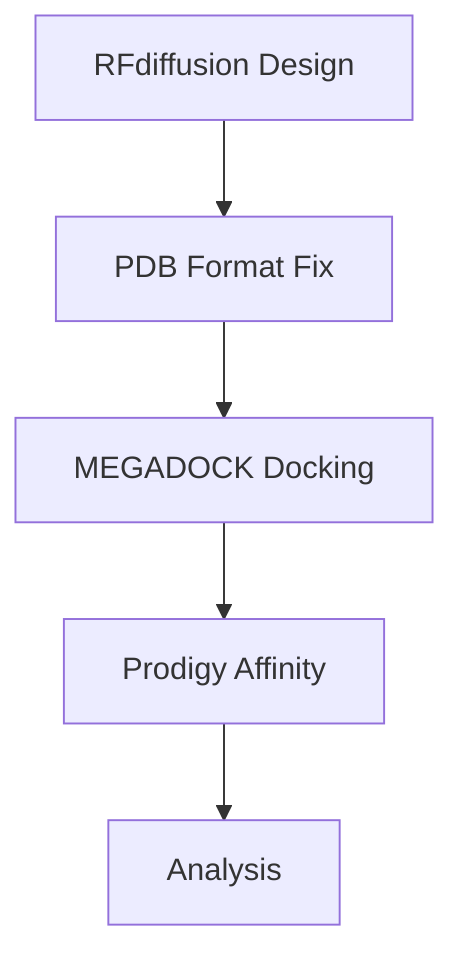

# RFdiffusion Protein Design & Docking Pipeline


This pipeline combines RFdiffusion for protein design with MEGADOCK for protein docking and Prodigy for binding affinity calculations.

## Table of Contents
1. [Protein Design with RFdiffusion](#1-protein-design-with-rfdiffusion)
2. [Protein Docking with MEGADOCK](#2-protein-docking-with-megadock)
3. [Binding Affinity Calculation](#3-binding-affinity-calculation)

---

## 1. Protein Design with RFdiffusion

Design protein aptamers using RFdiffusion:

```bash
./scripts/run_inference.py \
  'contigmap.contigs=[8-30/A31-41/8-30]' \
  contigmap.length=8-30 \
  inference.input_pdb=/path/to/input_pdb/6lzg-A.pdb \
  inference.output_prefix=/path/to/outputs/6lzg-A \
  inference.num_designs=10
```

*Note:* 0. Searching for a similar chain in PDB using Biopython and multialign

We have an RBD part that communicates with ACE2. Multi-alignment is used to find similar parts in the RDB obtained using AlphaFold. The result in the form of a chain is further fed to the RFD input.

---

## 2. Sequence design with ProteinMPNN

RFdiffusion is a backbone-generation model and does not generate sequence for the designed region, therefore, another method must be used to assign a sequence to the binders.
Git clone [ProteinMPNN](https://github.com/dauparas/ProteinMPNN/tree/main) and run ./util_scripts/run_protein_mpnn.sh from repo folder.

```bash
cd ProteinMPNN
./util_scripts/run_protein_mpnn.sh
```

All in one
```bash
cat /home/shared/alyanova/protein_mpnn_outputs/seqs/all_sequences.fa
```

---

## 3. MAFFT aling

[Install MAFFT](https://mafft.cbrc.jp/alignment/software/linux.html)
[Online version](https://mafft.cbrc.jp/alignment/server/)

Visualisation by stackbar plot.

## 2. Protein Docking with MEGADOCK

### Installation
Requires MEGADOCK-GPU (non-MPI version):
```bash
git clone https://github.com/akiyamalab/MEGADOCK
```
**Important:** Use GCC 10 (specify in Makefile):
```makefile
NVCC := $(CUDA_INSTALL_PATH)/bin/nvcc -Xcompiler -fopenmp -arch=$(SM_VERSIONS) -use_fast_math -ccbin=g++-10
```

### Preprocessing
RFdiffusion outputs need reformatting (PDB line length < 80 chars):
```bash
python ./util_scripts/fix_pdb.py
```

### Running Docking
```bash
sudo ./util_scripts/script_multi_dock.sh
```

**Output:**  
Complex files named `*-complex.pdb` where:
- Receptor chains retain original names (A, B, C...)
- Ligand chains (designed aptamers) are renamed to Y

---

## 3. Binding Affinity Calculation

### Setup Prodigy
```bash
python -m venv ./venv
source ./venv/bin/activate
pip install prodigy-prot
```

### Calculation Script
```bash
#!/bin/bash
# ./util_scripts/script_affinity.sh

OUTPUT_FILE="prodigy_results.txt"
> "$OUTPUT_FILE"

for pdb in $(find . -name *-complex.pdb); do
  echo "===== Calculating for $pdb =====" >> "$OUTPUT_FILE"
  prodigy "$pdb" --selection A Y >> "$OUTPUT_FILE" 2>&1
  echo "" >> "$OUTPUT_FILE"
done
```

**Usage:**
```bash
chmod +x script_affinity.sh
./script_affinity.sh
```

**Output Analysis:**  
The results in `prodigy_results.txt` can be used for binding affinity analysis and visualization.

---

## Pipeline Overview

